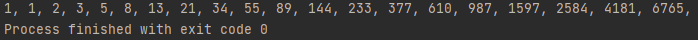

# 黄金分割数列（Fibonacci sequence）

### 递归实现

一棵树每年都在生长，长成后可以生出新枝干

**Tree类**

```java
public class Tree {
    boolean growth;
    ArrayList son;

    public Tree(int year){
        son=new ArrayList();
        growth=false;

        while (1 < year) {
            year--;
            if (!growth) {
                growth = true;
                continue;
            }

            //子又有子
            son.add(new Tree(year));
        }

        //计算接上树枝总数
        Count.count+=son.size();
    }
}

```

### 输出

